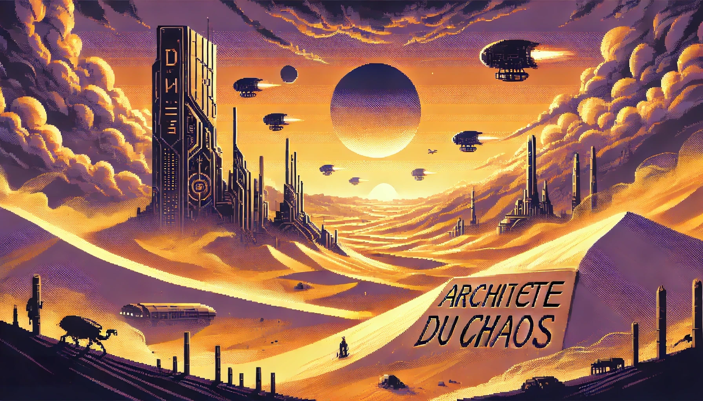
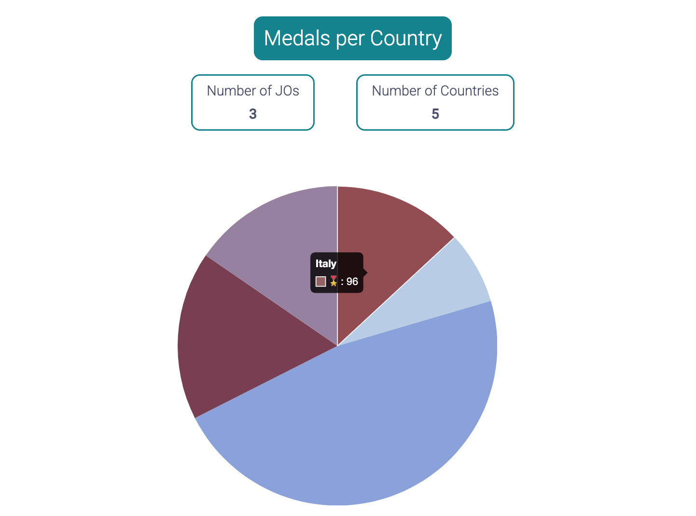
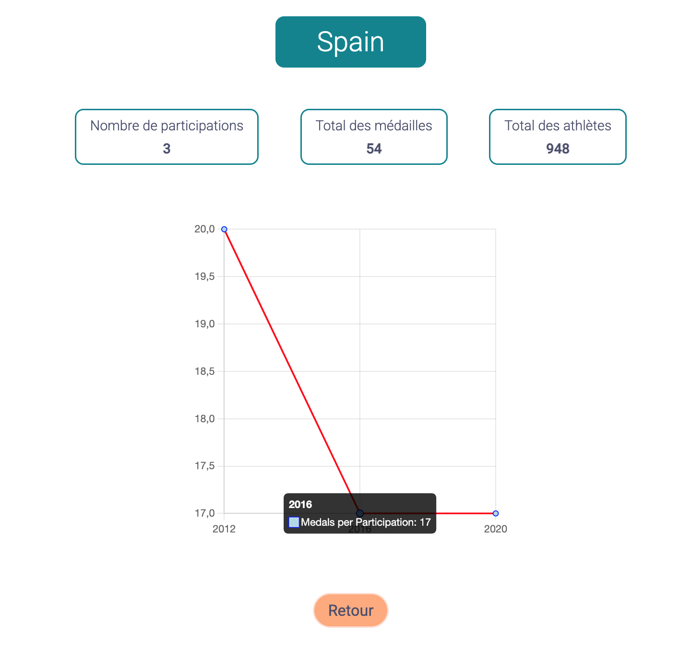
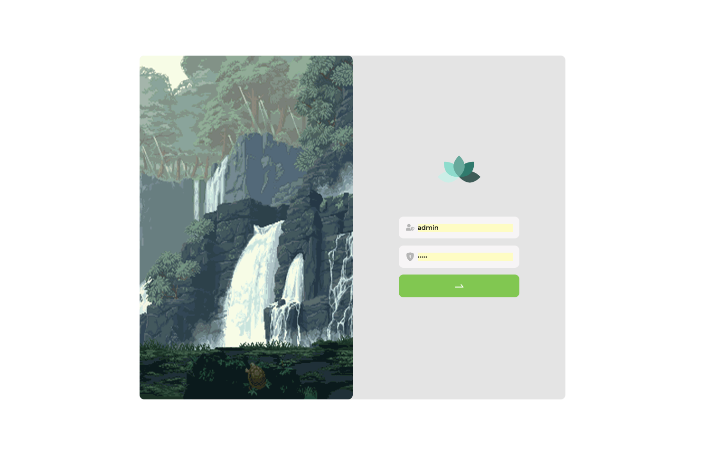
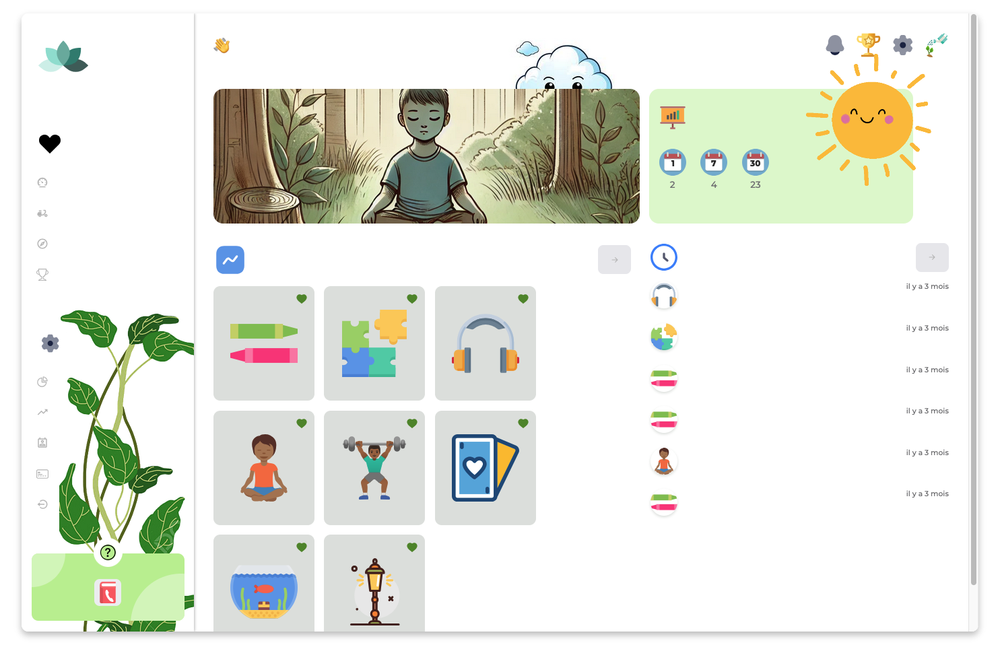
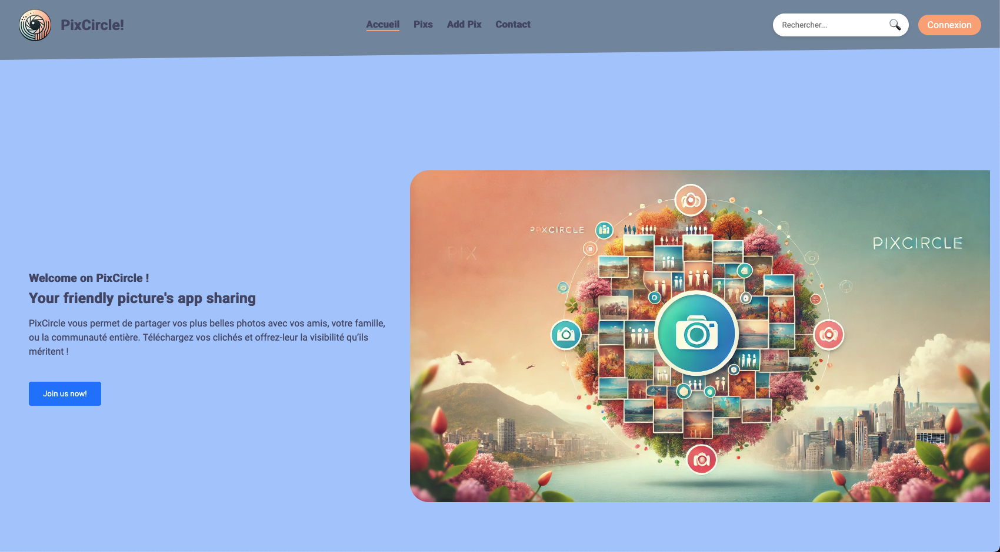
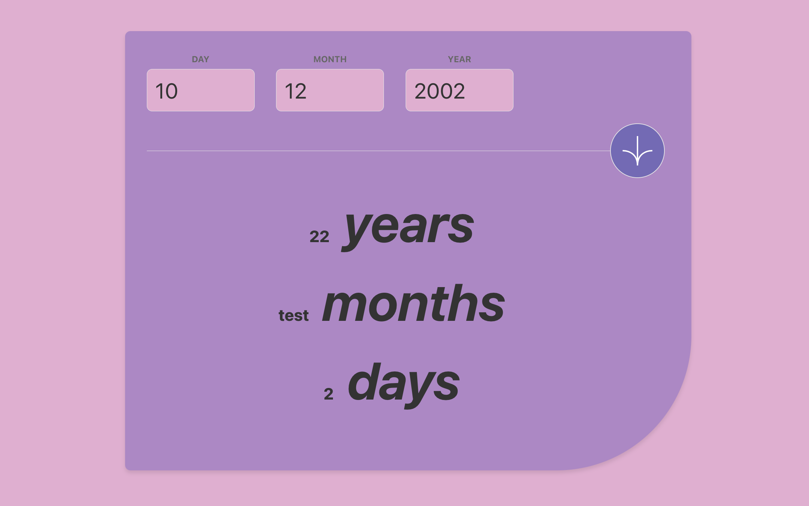

# Bienvenue sur mon profil GitHub !

Développeur passionné avec une expertise polyvalente en **développement web**, **logiciel** et **DevOps**, je conçois et optimise des applications modernes, scalables et performantes.

📌 **Spécialités :**
- Développement **frontend** & **backend** avec une stack **fullstack moderne**
- **Cloud & DevOps** : Conteneurisation, orchestration, CI/CD, monitoring
- **Architecture & scalabilité** : microservices, bases de données optimisées
- **Tests & Qualité** : Storybook, Jest, Vitest
- **Fondamentaux de la programmation** : gestion mémoire, structures de données, complexité algorithmique
- **Soft Skills** : gestion de projet, hackathons, préparation aux entretiens techniques

---

# **💻 Stack & Compétences**  

## **🌍 Cloud & Infrastructure**

🚀 **Expérience** : Déploiement de microservices sur Google Cloud avec **Docker & Kubernetes**, gestion des bases de données distribuées et monitoring avancé.

---

## **🐳 Conteneurisation & DevOps**

🔥 **Mise en place d’une infrastructure complète :**
- Automatisation CI/CD avec **GitHub Actions & Jenkins**
- Gestion des conteneurs avec **Docker** & orchestration avec **Kubernetes**
- Optimisation du scaling via **GKE & LoadBalancer**
- Sécurisation des bases de données et gestion des secrets

---

## **📡 Bases de données & Gestion des secrets**

🔹 **Gestion des données & Sécurité** :
- **Optimisation des performances SQL & NoSQL**
- Sécurisation des accès via **.env, Google Cloud Secrets Manager**
- Gestion des transactions avec **Spring Data, Prisma ORM, Mongoose**

---

## **💻 Langages & Frameworks**
### **🔹 Langages**

📌 **Compétences en programmation** : paradigmes POO, programmation fonctionnelle & réactive, optimisation des performances, principes SOLID, DRY, KISS, YAGNI.

---

### **🔹 Frontend**

🚀 **Expérience** : Développement de SPA & SSR, gestion d’état avec Context API et Redux, intégration de Storybook, optimisations de performances et accessibilité.

---

### **🔹 Backend**

📌 **Expérience** : Développement d’APIs RESTful & GraphQL, gestion des authentifications OAuth2 & JWT, mise en place de microservices, tests unitaires et intégration continue.

---

## **📖 Expérience DevOps**
🎯 **Mise en place complète d’une infrastructure cloud** sur **Google Cloud** :
- Déploiement de microservices avec **Docker & Kubernetes**
- Automatisation des pipelines CI/CD avec **GitHub Actions & Jenkins**
- Monitoring avancé avec **Prometheus & Grafana**
- Sécurisation des bases de données et gestion des secrets via **Google Cloud Secrets Manager**

---

📌 **Soft Skills & Approche Pro** : Expérience en freelance, gestion de projet agile, participation à des hackathons, préparation aux entretiens techniques et optimisation des workflows de développement.

##  Mes Projets

| Projet | Description | Preview | 
|--------|-------------|---------|
| [Telesport](https://github.com/Escanor1986/Telesport) | Telesport est une application **Angular** déployée sur **GitHub Pages**. Elle affiche des données sportives (par exemple, médailles et participations aux Jeux Olympiques) à l'aide de composants et de services. Ce projet démontre l'usage d'**Observables**, du **Routing**, ainsi que l'intégration d'une **Chart Library** pour la visualisation de données. [App Link](https://escanor1986.github.io/Telesport) |   |
| Odoo Hackathon 2024 | Odoo Hackathon est une application web déployée sur **Google Cloud Platform (GCP)** à l'aide de **Kubernetes (GKE), Docker et Artifact Registry**. L'application repose sur une architecture scalable et utilise **React (Vite) pour le frontend, Node.js/Express pour le backend et MariaDB pour la base de données**. Ce projet a été réalisé dans le cadre d'un hackathon, mettant en avant les bonnes pratiques DevOps et Cloud-Native. USER / PASSWORD : "admin" [App Link](http://35.241.147.228/) |  |
| [PixCircle](https://github.com/Escanor1986/PixCircle) | PixCircle est une application web responsive développée avec Angular 19, TypeScript, SCSS, GitHub Pages, angular-cli-ghpages. Cette application met en avant des fonctionnalités modernes et une architecture scalable, tirant parti des meilleures pratiques d'Angular pour offrir une expérience utilisateur optimale.  [App Link](https://escanor1986.github.io/PixCircle/) |  |
| [Online Age Calculator](https://github.com/Escanor1986/age-calculator) | Cette application dont la charte graphique provient de Frontend Mentor (et adapté niveau palette de couleurs) est réalisée en Vanilla JS avec HTML, CSS et Vite comme Bundler. Le site est déployé de manière statique sur GitHub Pages via GitHub Actions pour une intégration et un déploiement continu. La partie la plus tricky de ce projet provenait de l'utilisation de l'API Date de JavaScript. [App Link](https://escanor1986.github.io/age-calculator/) |  |
| Chemin de conscience | Ce site web pour l'association Chemins de Conscience A.S.B.L. est une application fullstack construite avec Next.js / TypeScript en utilisant une base de données SQL pour stocker les données. Le frontend, stylisé avec Tailwind CSS, est entièrement responsive et inclut des fonctionnalités avancées telles qu'un carrousel d'images interactif, une recherche textuelle optimisée, et des composants pour la gestion des images et des vidéos. L'application est déployée sur Vercel, assurant une intégration et un déploiement continus. [App Link](https://www.cheminsdeconscience.com/) |  |
| [Connect 4 - OOP - Game](https://github.com/Escanor1986/Intermediate_JavaScript/tree/main/Classe_ES6/connect_four_OO/connect4_oo) | Ceci est un jeu Puissance 4 développé en utilisant Vite, TypeScript en OOP, et déployé sur GitHub Pages. Le jeu permet à deux joueurs de choisir la couleur de leurs pièces et de jouer une partie traditionnelle de Connect 4 dans le navigateur. [App Link](https://escanor1986.github.io/Intermediate_JavaScript/) |  |
| [House Way - Locations de vacances](https://github.com/Escanor1986/Vacations_RBNB_Rentals) | Cette application fullstack de location de vacances, construite avec React pour le frontend et Node.js/Express pour le backend, utilise MongoDB comme base de données. Elle inclut des fonctionnalités de gestion d'utilisateurs avec authentification JWT, la création, la modification et la suppression de locations, et des contrôles d'accès basés sur les rôles pour sécuriser les routes et les opérations. Le déploiement est effectué via GitHub Pages pour le frontend et Heroku pour le backend. [App Link](https://escanor1986.github.io/Vacations_RBNB_Rentals/#/signup) |  |
| [Waver - Réseau social](https://github.com/Escanor1986/WaveTides) | Application web inspirée de Twitter construite avec Node.js, Express, Pug et Bootstrap 5 pour des publications, un fil d'actualité personnalisé et une interaction sociale. Profitez d'une expérience de microblogging moderne ! [App Link](https://waver-493c140e7e9c.herokuapp.com/auth/signin/form) |  |
| [Page produit site e-commerce](https://github.com/Escanor1986/Page_produit_site_e_commerce) | Page produit d'un site de e-commerce en React avec TypeScript via Vite avec Tailwind et Storybook. Maquette depuis Figma. [App Link](https://escanor1986.github.io/Page_produit_site_e_commerce/) |  |
| [Kanap - site vente de canapé](https://github.com/Escanor1986/Kanap_Site_ECommerce) | Kanap est une plateforme e-commerce fullstack pour la vente de canapés, utilisant HTML5, CSS3, et JavaScript pour le frontend, et Node.js, Express, et MongoDB pour le backend. L'application offre une API REST déployée sur Heroku avec une interface utilisateur déployée sur GitHub Pages. [App Link](https://escanor1986.github.io/Kanap_Site_ECommerce/) |  |
| [Calculatrice](https://github.com/Escanor1986/Calculatrice-en-TypeScript-avec-Tailwind) | Application de calculatrice qui prend en charge les opérations de base (addition, soustraction, multiplication, division) avec une interface utilisateur conviviale. Utilisation de TypeScript pour renforcer le typage et la maintenance du code. [App Link](https://escanor1986.github.io/Calculatrice-en-TypeScript-avec-Tailwind/) |  |
| [Todo List](https://github.com/Escanor1986/React-Todo) | Cette application TodoList est un exemple simple de gestion des tâches à faire. Elle vous permet d'ajouter, de supprimer, de valider et de modifier des tâches. Utilisation d'une architecture complexe en combinant l'utilisation des hooks useReducer et useContext afin de rendre le code scalable et maintenable. [App Link](https://escanor1986.github.io/React-Todo/) |  |
| [Game On - Landing Page](https://github.com/Escanor1986/GameOn-website-FR) | Landing Page permettant l'ouverture d'une modal pour la complétion d'un formulaire d'inscription à un tournoi de jeu vidéo avec confirmation par email de votre inscription. [App Link](https://escanor1986.github.io/GameOn-website-FR/) |  |
| [Blog JavaScript](https://github.com/Escanor1986/P_JavaScript_Blog) | Ce projet est un blog en ligne permettant aux utilisateurs de créer, modifier, supprimer, trier et paginer des articles de blog. Il utilise Webpack pour la gestion des modules JavaScript et Sass pour les styles. [App Link](https://escanor1986.github.io/P_JavaScript_Blog/) |  |
| [Site hébergement - Booki](https://github.com/Escanor1986/P2_Booki) | Booki est un site web permettant de trouver des hébergements pour des vacances de rêve à Marseille. Il offre également une sélection d'activités à découvrir dans la région. [App Link](https://escanor1986.github.io/P2_Booki/) |  | 
| [Agence Hapinesu Homu](https://github.com/Escanor1986/Agence_Hapinesu_Homu) | Ce projet est un modèle de site web pour une agence immobilière appelée "ハピネスホーム - Hapinesu Hōmu". Il est conçu pour présenter les propriétés exceptionnelles proposées par l'agence, fournir des informations sur l'équipe, afficher des témoignages de clients satisfaits et offrir un formulaire de contact pour que les clients potentiels puissent nous contacter. [App Link](https://escanor1986.github.io/Agence_Hapinesu_Homu/) |  | 
| [Générateur de cookies](https://github.com/Escanor1986/Coockies) | Ce projet est un générateur de cookies simple réalisé avec HTML, CSS et JavaScript. Il permet à l'utilisateur de créer, afficher et supprimer des cookies en spécifiant leur nom et leur valeur. [App Link](https://escanor1986.github.io/Coockies/) |  | 
| [Site de restaurants en ligne](https://github.com/Escanor1986/P3_Oh_My_Food) | Ohmyfood! est un site web interactif permettant aux utilisateurs de découvrir des restaurants d'exception et de composer leur menu préféré en ligne. [App Link](https://escanor1986.github.io/P3_Oh_My_Food/) |  | 
| [Quizz - Culture générale](https://github.com/Escanor1986/Quizz) | Ce projet est une application web permettant de passer un quiz de culture générale. L'utilisateur peut répondre à plusieurs questions et voir ses résultats en fonction de ses réponses. [App Link](https://escanor1986.github.io/Quizz/) |  | 
| [Calcule IMC](https://github.com/Escanor1986/Calcul_IMC) | Ce projet est une application web simple permettant de calculer l'Indice de Masse Corporelle (IMC) d'un utilisateur en fonction de sa taille et de son poids. [App Link](https://escanor1986.github.io/Calcul_IMC/) |  | 
| [Agence La Panthère](https://github.com/Escanor1986/P4_La_Panthere) | Agence La Panthère est un site web présentant les services d'une agence web basée à Lyon. Le site met en avant les compétences de l'agence dans les domaines du web design, de la stratégie web et des illustrations. [App Link](https://escanor1986.github.io/P4_La_Panthere/) |  | 

N'hésitez pas à explorer mes repositories pour découvrir l'ensemble de mes projets !

##  **Contact**
📌 **LinkedIn** : [Mon profil](linkedin.com/in/lionelzovi)  
📧 **Email** : `lionel.zovi@gmail.com`  
💬 **Discutons de projets & collaborations !** 😊  

