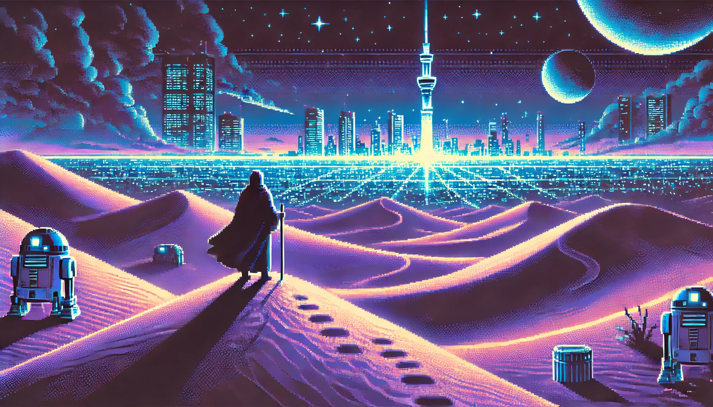

# Hello, I'm Lionel Zovi 👋

Fullstack Web Developer passionate about creating scalable, performant, and user-friendly applications. I specialize in modern JavaScript ecosystems and DevOps practices.

## 💻 Core Technologies

  
  **Frontend** | **Backend** | **DevOps & Cloud**
  :---: | :---: | :---:
   |  | 
   |  | 
   |  | 
   |  | 

## 🚀 What I Do

- **Fullstack Development**: Creating responsive, accessible web applications with modern frameworks
- **Cloud-Native Solutions**: Participated in the development and realized the deployement of a cloud-native application utilizing containerization and orchestration technologies.
- **DevOps Practices**: Implementing CI/CD pipelines and infrastructure as code
- **Architecture Design**: Experience in implementing layered and MVC (Model-View-Controller) architectural patterns in application development.
- **Performance Optimization**: Enhancing application performance and user experience

## 📂 Featured Projects

For a complete showcase of my projects with detailed descriptions, code samples, and live demos, please visit [my portfolio](https://escanor1986.github.io/projects/).

Here are a few highlights:

- **[Odoo Hackathon](https://github.com/Escanor1986/hackathon-2024)**: Cloud-native application deployed on GCP with Kubernetes
- **[Telesport](https://github.com/Escanor1986/Telesport)**: Angular data visualization application
- **[House Way](https://github.com/Escanor1986/Vacations_RBNB_Rentals)**: Fullstack vacation rental platform

## 📚 Always Learning

I maintain a [technology watch](https://escanor1986.github.io/veille_techno-OC/) where I document trends and innovations in web development. I'm currently exploring:

- Edge computing and serverless architectures
- Web performance optimization techniques
- Advanced TypeScript patterns
- Web accessibility standards

## 🤝 Open Source Contributions

I'm an active contributor to [NX Academy](https://nx.academy/), an outstanding open-source learning platform developed by a colleague. NX Academy provides free, high-quality web development education accessible to everyone.

As a technical writer, I create comprehensive articles and tutorials on modern JavaScript frameworks, best practices, performance optimization, and deployment strategies. This allows me to share knowledge with the community while continuously refining my own understanding of complex concepts.

## 📫 Let's Connect

- **Email**: [lionel.zovi@gmail.com](mailto:lionel.zovi@gmail.com)
- **LinkedIn**: [linkedin.com/in/lionelzovi](https://linkedin.com/in/lionelzovi)
- **Portfolio**: [escanor1986.github.io](https://escanor1986.github.io)

Feel free to reach out for collaborations, opportunities, or just to exchange ideas about web development!

