#  Bienvenue sur mon profil GitHub ! 

Développeur passionné avec une expertise variée dans le domaine du développement web et logiciel, Je travaille principalement avec les technologies suivantes :

## Langages de programmation
- Langages de programmation : 
 
  
  
  
- Frameworks : 
  
  
  
- Outils de styling : 
  
  
  
  
  
- Backend : 
  
  
  
- Bases de données : 
  
  
- Outils de déploiement :
  
  
  
- Outils de build : 
  
  
- Outils de test : 
  
  
  
- Outils CI/CD :
  
- Libraries UI :
  

Je suis également familier avec les pratiques de développement telles que les pipelines CI/CD (GitHub Actions), l'automatisation des tests, et la gestion de versions avec Git et GitHub.

##    Mes Projets

| Projet | Description | Preview |
|--------|-------------|---------|
| Chemin de conscience | Ce site web pour l'association Chemins de Conscience A.S.B.L. est une application fullstack construite avec Next.js / TypeScript en utilisant une base de données SQL pour stocker les données. Le frontend, stylisé avec Tailwind CSS, est entièrement responsive et inclut des fonctionnalités avancées telles qu'un carrousel d'images interactif, une recherche textuelle optimisée, et des composants pour la gestion des images et des vidéos. L'application est déployée sur Vercel, assurant une intégration et un déploiement continus. [App Link](https://www.cheminsdeconscience.com/) | 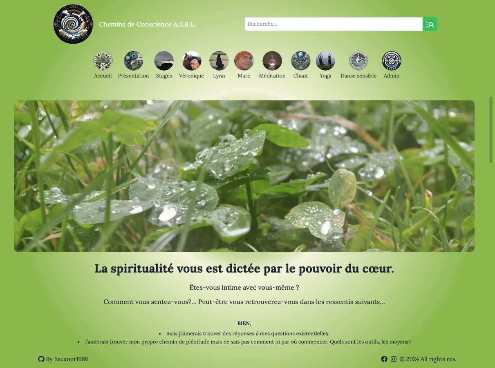 |
| [Connect 4 - OOP - Game](https://github.com/Escanor1986/Intermediate_JavaScript/tree/main/Classe_ES6/connect_four_OO/connect4_oo) | Ceci est un jeu Puissance 4 développé en utilisant Vite, TypeScript en OOP, et déployé sur GitHub Pages. Le jeu permet à deux joueurs de choisir la couleur de leurs pièces et de jouer une partie traditionnelle de Connect 4 dans le navigateur. [App Link](https://escanor1986.github.io/Intermediate_JavaScript/) | 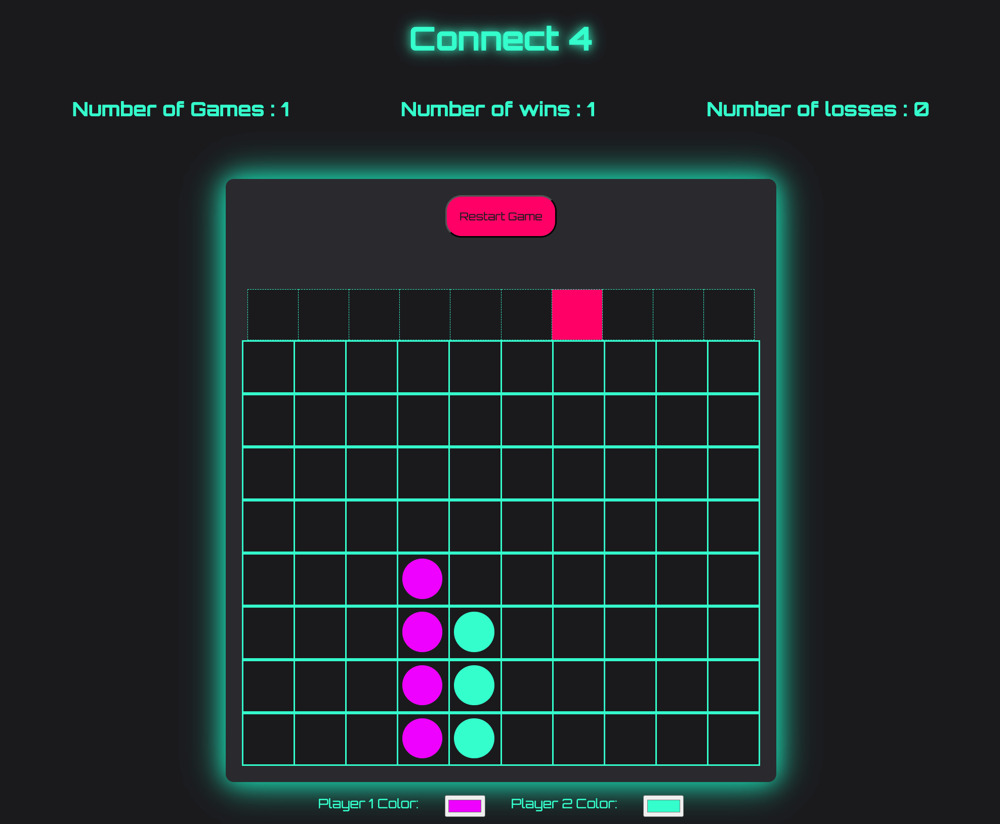 |
| [House Way - Locations de vacances](https://github.com/Escanor1986/Vacations_RBNB_Rentals) | Cette application fullstack de location de vacances, construite avec React pour le frontend et Node.js/Express pour le backend, utilise MongoDB comme base de données. Elle inclut des fonctionnalités de gestion d'utilisateurs avec authentification JWT, la création, la modification et la suppression de locations, et des contrôles d'accès basés sur les rôles pour sécuriser les routes et les opérations. Le déploiement est effectué via GitHub Pages pour le frontend et Heroku pour le backend. [App Link](https://escanor1986.github.io/Vacations_RBNB_Rentals/#/signup) | 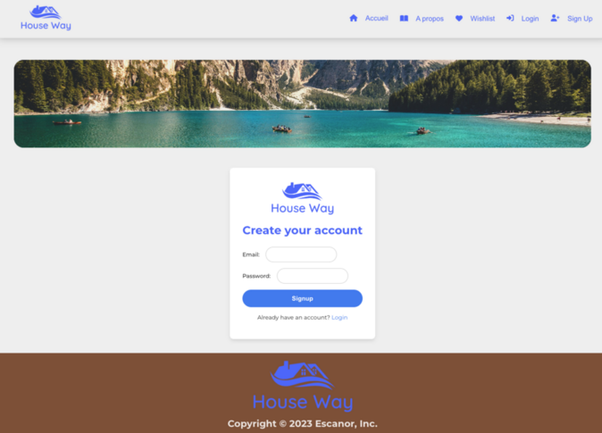 |
| [Waver - Réseau social](https://github.com/Escanor1986/WaveTides) | Application web inspirée de Twitter construite avec Node.js, Express, Pug et Bootstrap 5 pour des publications, un fil d'actualité personnalisé et une interaction sociale. Profitez d'une expérience de microblogging moderne ! [App Link](https://waver-493c140e7e9c.herokuapp.com/auth/signin/form) | 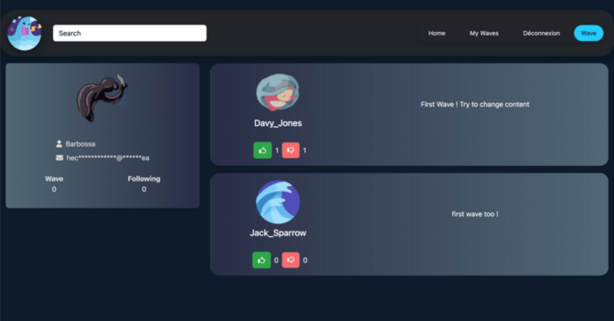 |
| [Page produit site e-commerce](https://github.com/Escanor1986/Page_produit_site_e_commerce) | Page produit d'un site de e-commerce en React avec TypeScript via Vite avec Tailwind et Storybook. Maquette depuis Figma. [App Link](https://escanor1986.github.io/Page_produit_site_e_commerce/) | 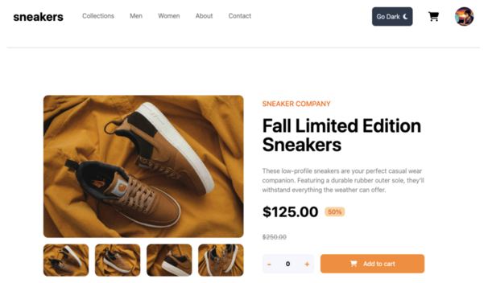 |
| [Kanap - site vente de canapé](https://github.com/Escanor1986/Kanap_Site_ECommerce) | Kanap est une plateforme e-commerce fullstack pour la vente de canapés, utilisant HTML5, CSS3, et JavaScript pour le frontend, et Node.js, Express, et MongoDB pour le backend. L'application offre une API REST déployée sur Heroku avec une interface utilisateur déployée sur GitHub Pages. [App Link](https://escanor1986.github.io/Kanap_Site_ECommerce/) |  |
| [Calculatrice](https://github.com/Escanor1986/Calculatrice-en-TypeScript-avec-Tailwind) | Application de calculatrice qui prend en charge les opérations de base (addition, soustraction, multiplication, division) avec une interface utilisateur conviviale. Utilisation de TypeScript pour renforcer le typage et la maintenance du code. [App Link](https://escanor1986.github.io/Calculatrice-en-TypeScript-avec-Tailwind/) | 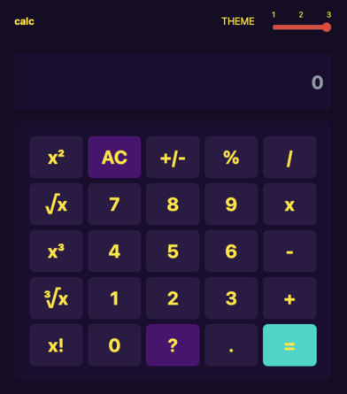 |
| [Todo List](https://github.com/Escanor1986/React-Todo) | Cette application TodoList est un exemple simple de gestion des tâches à faire. Elle vous permet d'ajouter, de supprimer, de valider et de modifier des tâches. Utilisation d'une architecture complexe en combinant l'utilisation des hooks useReducer et useContext afin de rendre le code scalable et maintenable. [App Link](https://escanor1986.github.io/React-Todo/) | 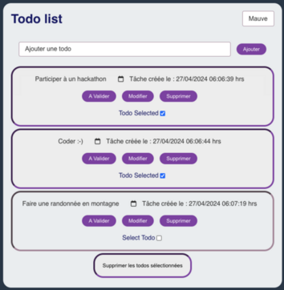 |
| [Game On - Landing Page](https://github.com/Escanor1986/GameOn-website-FR) | Landing Page permettant l'ouverture d'une modal pour la complétion d'un formulaire d'inscription à un tournoi de jeu vidéo avec confirmation par email de votre inscription. [App Link](https://escanor1986.github.io/GameOn-website-FR/) | 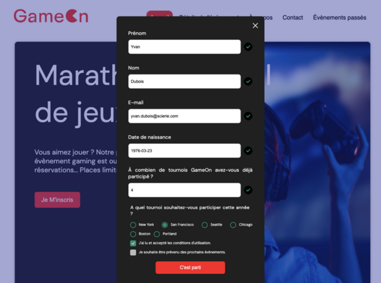 |
| [Blog JavaScript](https://github.com/Escanor1986/P_JavaScript_Blog) | Ce projet est un blog en ligne permettant aux utilisateurs de créer, modifier, supprimer, trier et paginer des articles de blog. Il utilise Webpack pour la gestion des modules JavaScript et Sass pour les styles. [App Link](https://escanor1986.github.io/P_JavaScript_Blog/) | 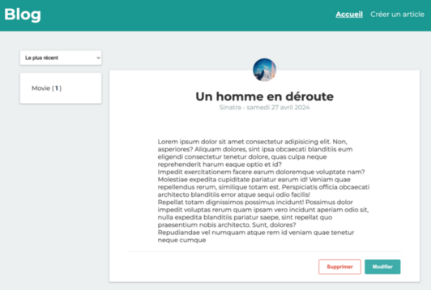 |
| [Site hébergement - Booki](https://github.com/Escanor1986/P2_Booki) | Booki est un site web permettant de trouver des hébergements pour des vacances de rêve à Marseille. Il offre également une sélection d'activités à découvrir dans la région. [App Link](https://escanor1986.github.io/P2_Booki/) | 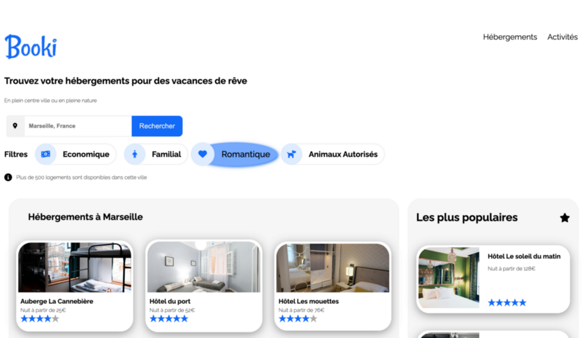 | 
| [Agence Hapinesu Homu](https://github.com/Escanor1986/Agence_Hapinesu_Homu) | Ce projet est un modèle de site web pour une agence immobilière appelée "ハピネスホーム - Hapinesu Hōmu". Il est conçu pour présenter les propriétés exceptionnelles proposées par l'agence, fournir des informations sur l'équipe, afficher des témoignages de clients satisfaits et offrir un formulaire de contact pour que les clients potentiels puissent nous contacter. [App Link](https://escanor1986.github.io/Agence_Hapinesu_Homu/) | 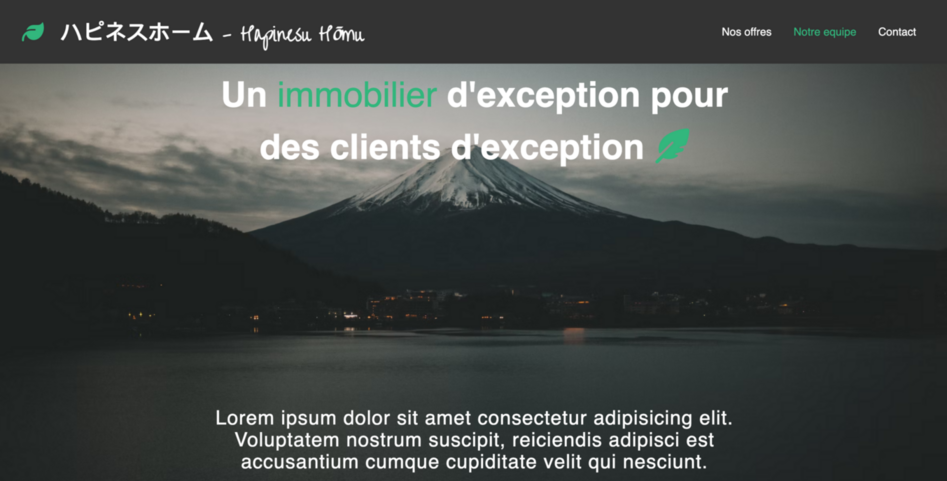 | 
| [Générateur de cookies](https://github.com/Escanor1986/Coockies) | Ce projet est un générateur de cookies simple réalisé avec HTML, CSS et JavaScript. Il permet à l'utilisateur de créer, afficher et supprimer des cookies en spécifiant leur nom et leur valeur. [App Link](https://escanor1986.github.io/Coockies/) | 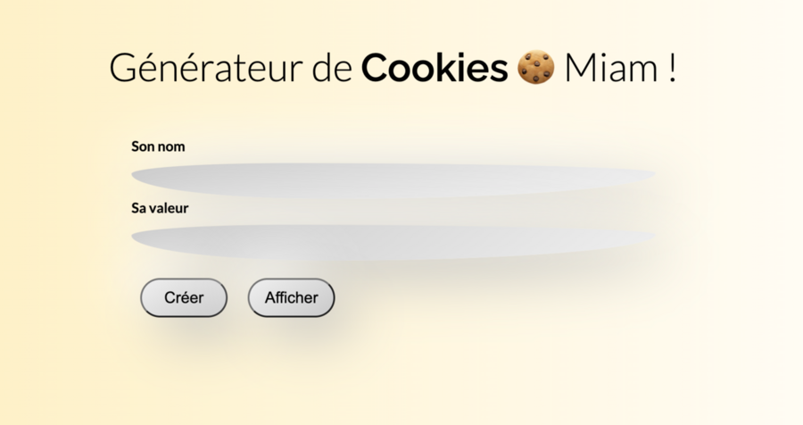 | 
| [Site de restaurants en ligne](https://github.com/Escanor1986/P3_Oh_My_Food) | Ohmyfood! est un site web interactif permettant aux utilisateurs de découvrir des restaurants d'exception et de composer leur menu préféré en ligne. [App Link](https://escanor1986.github.io/P3_Oh_My_Food/) |  | 
| [Quizz - Culture générale](https://github.com/Escanor1986/Quizz) | Ce projet est une application web permettant de passer un quiz de culture générale. L'utilisateur peut répondre à plusieurs questions et voir ses résultats en fonction de ses réponses. [App Link](https://escanor1986.github.io/Quizz/) | 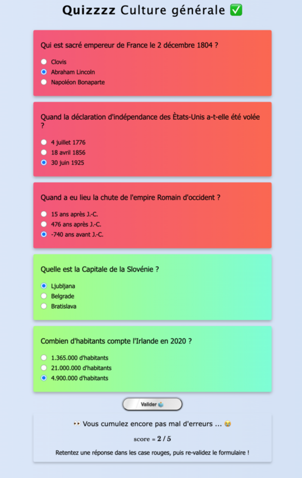 | 
| [Calcule IMC](https://github.com/Escanor1986/Calcul_IMC) | Ce projet est une application web simple permettant de calculer l'Indice de Masse Corporelle (IMC) d'un utilisateur en fonction de sa taille et de son poids. [App Link](https://escanor1986.github.io/Calcul_IMC/) | 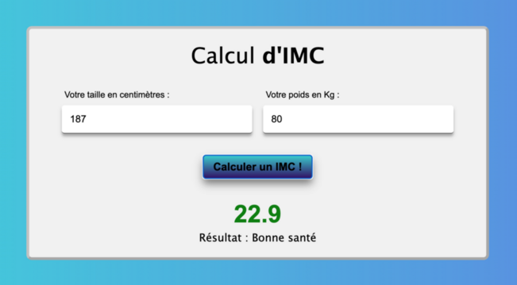 | 
| [Agence La Panthère](https://github.com/Escanor1986/P4_La_Panthere) | Agence La Panthère est un site web présentant les services d'une agence web basée à Lyon. Le site met en avant les compétences de l'agence dans les domaines du web design, de la stratégie web et des illustrations. [App Link](https://escanor1986.github.io/P4_La_Panthere/) | 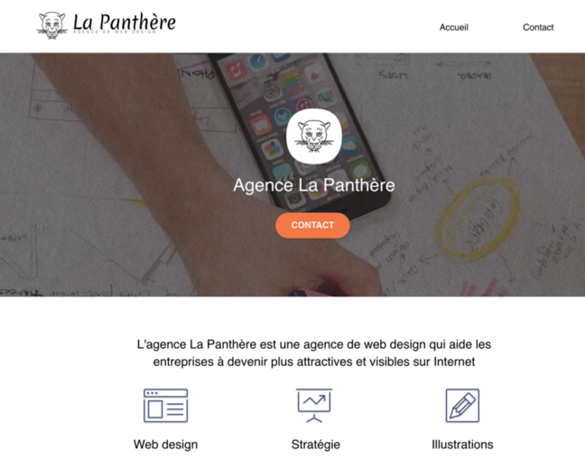 | 

N'hésitez pas à explorer mes repositories pour découvrir l'ensemble de mes projets !

##  Formations et Compétences 

Outre mes compétences techniques, je mets l'accent sur le développement continu en apprenant de nouvelles technologies et en perfectionnant mes compétences existantes. J'ai également développé de solides soft skills au cours de mon parcours professionnel, notamment la capacité à travailler en équipe, à gérer une/des équipes, à résoudre des problèmes complexes et à mener à bien des projets divers et variés. Deux de mes points forts sont ma résistance au stress et ma capacité de résilience/adaptation.

##  Contact

Pour en savoir plus sur mon parcours professionnel et mes réalisations, n'hésitez pas à consulter mon [profil LinkedIn](linkedin.com/in/lionelzovi).

N'hésitez pas à me contacter si vous souhaitez discuter de collaborations, de projets intéressants ou simplement échanger des idées ! 😊

